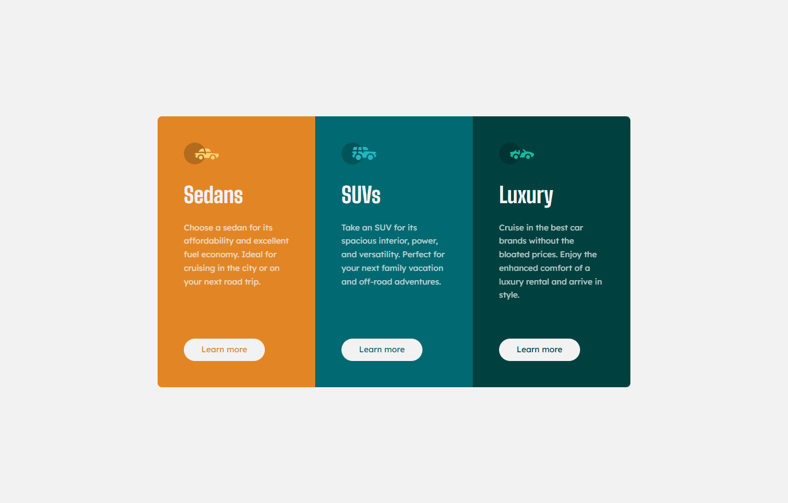

# Frontend Mentor - 3-column preview card component solution

This is a solution to the [3-column preview card component challenge on Frontend Mentor](https://www.frontendmentor.io/challenges/3column-preview-card-component-pH92eAR2-). Frontend Mentor challenges help you improve your coding skills by building realistic projects. 

## Overview

### The challenge

Users should be able to:

- View the optimal layout depending on their device's screen size
- See hover states for interactive elements

### Screenshot

### Links

- Solution URL: [GitHub](https://github.com/rradiohysteria/3-column-preview-card-component)
- Live Site URL: [GitHub Pages](https://rradiohysteria.github.io/3-column-preview-card-component/)

## My process

### Built with

- Semantic HTML5 markup
- CSS custom properties
- Flexbox
- Mobile-first workflow

## Notes

Couldn't figure out for a second why the buttons at the bottom were different height, but saw in the dev tools that there seemed to be space afterwards. What helped to fix that was:

1. Give the parent container a `min-height` below which they won't be able to go.
2. Give the div with the button `flex-grow: 1` so that it would take up remaining free space if there was any and occupy beyong its content's size.
3. `margin-top: auto` for the button, so that it ensures that it says at the bottom of the container.